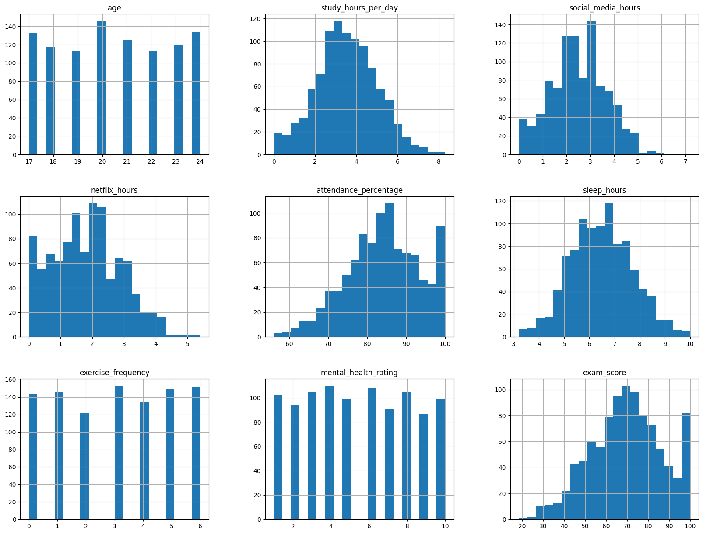
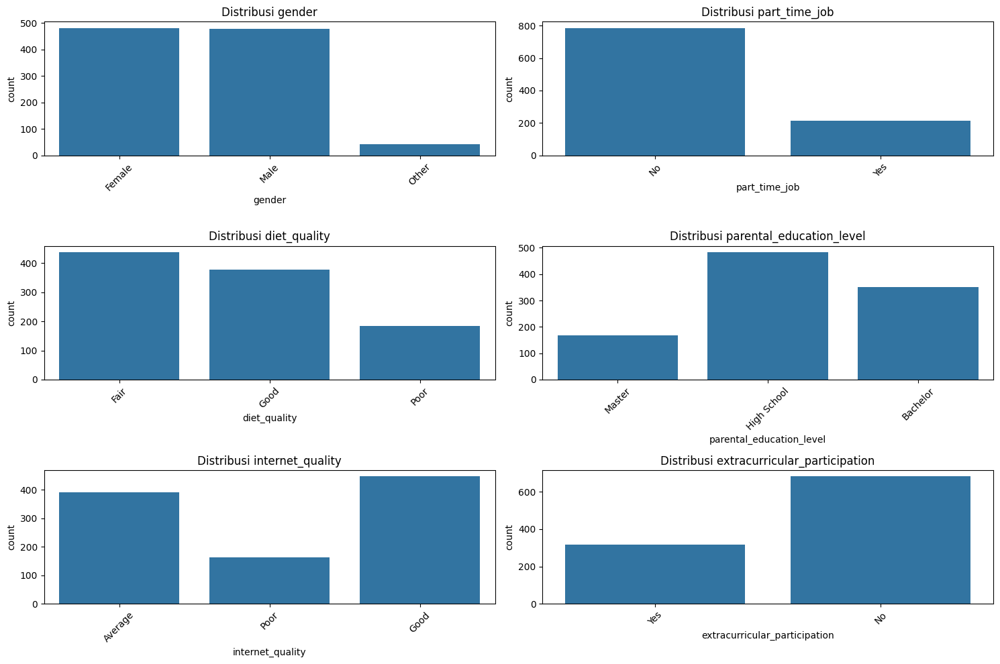
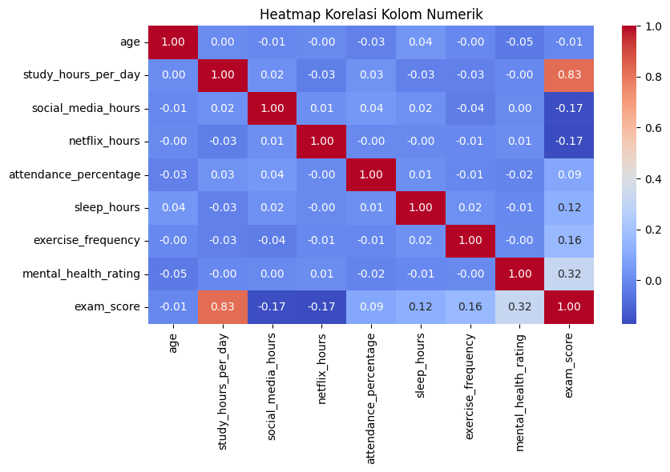
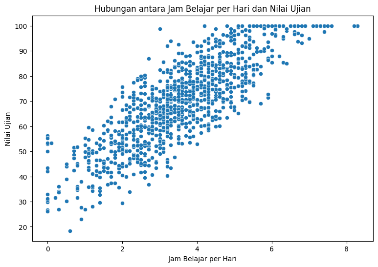
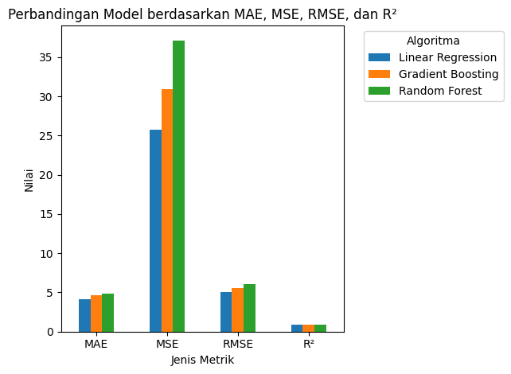

# Laporan Proyek Machine Learning - Ardana Aldhizuma Nugraha

## Domain Proyek

Bidang pendidikan memainkan peran penting dalam pembangunan individu dan kemajuan masyarakat. Seiring berkembangnya teknologi dan perubahan gaya hidup pelajar, muncul tantangan baru dalam memastikan keberhasilan akademik. Salah satu faktor utama yang mempengaruhi prestasi siswa adalah kebiasaan harian mereka, seperti durasi belajar, waktu tidur, partisipasi dalam kegiatan ekstrakurikuler, konsumsi media sosial, dan sebagainya. Memahami hubungan antara kebiasaan siswa dengan performa akademik dapat membantu institusi pendidikan, orang tua, dan siswa itu sendiri dalam mengambil keputusan yang lebih baik untuk meningkatkan hasil belajar.

Penelitian sebelumnya menunjukkan bahwa faktor-faktor seperti durasi belajar, kualitas tidur, dan kesehatan mental memiliki korelasi yang signifikan dengan prestasi akademik siswa [1][2]. Oleh karena itu, pendekatan berbasis data sangat relevan untuk mengeksplorasi dan memprediksi performa akademik siswa berdasarkan kebiasaan mereka sehari-hari.

Referensi:

1. Dewald, J. F., Meijer, A. M., Oort, F. J., Kerkhof, G. A., & Bögels, S. M. (2010). The influence of sleep quality, sleep duration and sleepiness on school performance in children and adolescents: A meta-analytic review. Sleep Medicine Reviews, 14(3), 179-189.

2. Nonis, S. A., & Hudson, G. I. (2006). Academic performance of college students: Influence of time spent studying and working. Journal of Education for Business, 81(3), 151-159.

## Business Understanding

### Problem Statements

Berdasarkan latar belakang yang telah diuraikan, beberapa permasalahan yang dapat diidentifikasi adalah:

- Faktor-faktor kebiasaan apa saja yang memiliki pengaruh signifikan terhadap performa akademik siswa?
- Bagaimana pengaruh penggunaan media sosial dan platform streaming terhadap nilai ujian siswa?
- Apakah faktor-faktor seperti kualitas tidur, pola makan, dan aktivitas fisik berkontribusi signifikan pada performa akademik?
- Seberapa akurat model machine learning dapat memprediksi performa akademik siswa berdasarkan kebiasaan dan karakteristik personal mereka?

### Goals

Tujuan dari proyek ini adalah:

- Mengidentifikasi dan menganalisis faktor-faktor kebiasaan yang memiliki korelasi kuat dengan performa akademik siswa.
- Mengukur dampak penggunaan media sosial dan platform streaming terhadap nilai ujian siswa.
- Mengevaluasi kontribusi faktor-faktor seperti kualitas tidur, pola makan, dan aktivitas fisik terhadap performa akademik.
- Membangun model machine learning yang dapat memprediksi performa akademik siswa dengan tingkat akurasi yang tinggi berdasarkan kebiasaan dan karakteristik personal.

### Solution statements

Untuk mencapai tujuan yang telah ditetapkan, beberapa pendekatan solusi yang akan diimplementasikan adalah:

- Melakukan Exploratory Data Analysis (EDA) untuk mengidentifikasi pola dan korelasi antara berbagai variabel kebiasaan dengan performa akademik.
- Mengembangkan beberapa model machine learning untuk memprediksi nilai ujian siswa:
  - Model Regresi Linear sebagai baseline model untuk memprediksi nilai ujian berdasarkan berbagai fitur.
  - Model Random Forest Regressor untuk menangkap hubungan non-linear antara variabel prediktor dan target.
  - Model Gradient Boosting Regressor untuk meningkatkan performa prediksi dengan teknik ensemble.

Performa solusi akan diukur menggunakan metrik evaluasi standar untuk masalah regresi seperti Mean Absolute Error (MAE), Mean Squared Error (MSE), Root Mean Squared Error (RMSE), dan koefisien determinasi (R²).

## Data Understanding

Dataset Student Habits vs Academic Performance berisi informasi tentang berbagai kebiasaan dan karakteristik siswa serta performa akademik mereka yang diukur melalui nilai ujian. Dataset ini terdiri dari 1000 entri dengan 16 variabel yang mencakup berbagai aspek kehidupan dan kebiasaan siswa. Dataset yang digunakan dalam proyek ini diambil dari Kaggle dan dapat diakses melalui tautan berikut: [Student Habits vs Academic Performance](https://www.kaggle.com/datasets/jayaantanaath/student-habits-vs-academic-performance).

### Variabel-variabel pada dataset adalah sebagai berikut:

1. `student_id`: Identifikasi unik untuk setiap siswa (`object`)
2. `age`: Usia siswa dalam tahun (`int64`)
3. `gender`: Jenis kelamin siswa (`object`)
4. `study_hours_per_day`: Jumlah jam belajar per hari (`float64`)
5. `social_media_hours`: Jumlah jam yang dihabiskan di media sosial per hari (`float64`)
6. `netflix_hours`: Jumlah jam menonton Netflix atau platform streaming serupa per hari (`float64`)
7. `part_time_job`: Apakah siswa memiliki pekerjaan paruh waktu (`object`)
8. `attendance_percentage`: Persentase kehadiran siswa di kelas (`float64`)
9. `sleep_hours`: Rata-rata jam tidur per hari (`float64`)
10. `diet_quality`: Kualitas pola makan siswa (`object`)
11. `exercise_frequency`: Frekuensi berolahraga per minggu (`int64`)
12. `parental_education_level`: Tingkat pendidikan tertinggi dari orang tua (`object`)
13. `internet_quality`: Kualitas koneksi internet siswa (`object`)
14. `mental_health_rating`: Skor penilaian kesehatan mental siswa (`int64`)
15. `extracurricular_participation`: Apakah siswa berpartisipasi dalam kegiatan ekstrakurikuler (`object`)
16. `exam_score`: Nilai ujian siswa yang merupakan variabel target (float64)

Beberapa observasi dari struktur dataset:

- Dataset memiliki 1000 entri dengan 909 data lengkap untuk variabel `parental_education_level` (terdapat 91 missing values)
- Terdapat 3 variabel numerik bertipe `int64`, 6 variabel numerik bertipe `float64`, dan 7 variabel kategorikal bertipe `object`
- Variabel target dalam dataset ini adalah `exam_score` yang menunjukkan performa akademik siswa

### Exploratory Data Analysis (EDA)

**1. Analisis Variabel Numerik**

Analisis variabel numerik menunjukkan distribusi dan statistik deskriptif dari variabel-variabel tersebut:

```py
df.hist(bins=20, figsize=(20, 15))
plt.show()
```



- Jam Belajar: Kebanyakan siswa belajar antara 1 sampai 6 jam per hari
- Penggunaan Media Sosial: Kebanyakan siswa menghabiskan antara 0 sampai 5 jam di media sosial setiap hari
- Penggunaan Netflix: Kebanyakan siswa menonton Netflix selama 0 sampai 3 jam setiap hari
- Persentase Kehadiran: Kebanyakan siswa memiliki kehadiran di atas 60%
- Jam Tidur: Mayoritas siswa tidur antara 4 sampai 9 jam per hari
- Nilai Ujian: Distribusi menunjukkan nilai berkisar dari sekitar 20 sampai 100, dengan rata-rata sekitar 69.6 dan simpangan baku 16.89

**2. Analisis Variabel Kategorikal**

Analisis variabel kategorikal menunjukkan perbedaan performa akademik berdasarkan berbagai kategori:

```py
fig, axes = plt.subplots(3, 2, figsize=(15, 10))
for i, col in enumerate(categorical_cols):
    ax = axes[i // 2, i % 2]
    sns.countplot(data=df, x=col, ax=ax)
    ax.set_title(f'Distribusi {col}')
    ax.tick_params(axis='x', rotation=45)
plt.tight_layout()
plt.show()
```



- Jenis Kelamin: Dataset memiliki lebih banyak siswa perempuan (481) daripada siswa laki-laki
- Pekerjaan Paruh Waktu: Kebanyakan siswa (785) tidak memiliki pekerjaan paruh waktu
- Kualitas Pola Makan: Kualitas pola makan yang paling umum adalah "Cukup" (437 siswa), diikuti oleh "Baik"
- Tingkat Pendidikan Orang Tua: SMA adalah tingkat yang paling umum (483 siswa)
- Kualitas Internet: Kebanyakan siswa memiliki kualitas internet "Baik" (447 siswa)
- Partisipasi Ekstrakurikuler: Mayoritas siswa (682) tidak berpartisipasi dalam kegiatan ekstrakurikuler

**3. Analisis Korelasi antara Variabel Numerik**

Analisis korelasi antara variabel numerik menunjukkan beberapa insight penting:

```py
numeric_cols = df.select_dtypes(include=['int64', 'float64']).columns
correlation = df[numeric_cols].corr()

plt.figure(figsize=(9, 6))
sns.heatmap(correlation, annot=True, cmap='coolwarm', fmt='.2f')
plt.title('Heatmap Korelasi Kolom Numerik')
plt.tight_layout()
plt.show()
```



- Korelasi positif kuat (0.83) antara jam belajar per hari dan nilai ujian
- Korelasi negatif (-0.17) antara jam media sosial dan nilai ujian
- Korelasi negatif (-0.17) antara jam Netflix dan nilai ujian
- Korelasi positif (0.12) antara jam tidur dan nilai ujian
- Korelasi positif (0.16) antara frekuensi olahraga dan nilai ujian
- Korelasi positif moderat (0.32) antara tingkat kesehatan mental dan nilai ujian

**4. Analisis antara Jam Belajar per Hari vs Nilai Ujian**

```py
plt.figure(figsize=(9, 6))
sns.scatterplot(x='study_hours_per_day', y='exam_score', data=df)
plt.title('Hubungan antara Jam Belajar per Hari dan Nilai Ujian')
plt.xlabel('Jam Belajar per Hari')
plt.ylabel('Nilai Ujian')
plt.show()
```



Plot menunjukkan bahwa ada hubungan positif antara jam belajar per hari dan nilai ujian siswa. Siswa yang belajar lebih banyak cenderung memiliki nilai ujian yang lebih tinggi.

## Data Preparation

Dalam tahap persiapan data, beberapa teknik preprocessing diterapkan untuk memastikan data dalam kondisi optimal untuk pemodelan machine learning:

### 1. Menghapus Kolom `student_id`

Kolom `student_id` dihapus karena tidak memberikan informasi yang relevan untuk analisis dan pemodelan.

```py
df.drop(columns=['student_id'], inplace=True)
```

### 2. Penanganan Missing Values

Pada dataset terdapat 91 missing values pada variabel 'parental_education_level'. Untuk menangani hal ini, kita menggunakan teknik imputasi dengan modus (nilai yang paling sering muncul) karena variabel tersebut bersifat kategorikal.

```py
# Mengecek missing values
print(df.isnull().sum())

# Menangani missing values dengan imputasi modus
most_frequent = df['parental_education_level'].mode()[0]
df['parental_education_level'].fillna(most_frequent, inplace=True)

# Memastikan tidak ada missing values lagi
print(df.isnull().sum())
```

Imputasi dengan modus dipilih untuk mempertahankan distribusi data yang sudah ada tanpa memasukkan nilai baru yang mungkin tidak sesuai dengan pola data.

### 3. Encoding Variabel Kategorikal

Untuk dapat digunakan dalam model machine learning, variabel kategorikal perlu diubah menjadi bentuk numerik dengan teknik encoding.

```py
# One-Hot Encoding untuk variabel kategorik

categorical_cols = ['gender', 'part_time_job', 'diet_quality', 'parental_education_level', 
                    'internet_quality', 'extracurricular_participation']

df_encoded = pd.get_dummies(df, columns=categorical_cols, drop_first=True)
```

One-Hot Encoding digunakan untuk variabel kategorikal nominal seperti `gender` dan `internet_quality` karena tidak ada hubungan ordinal (tingkatan) antar kategori. Pendekatan `drop_first=True` diterapkan untuk menghindari multikolinearitas dalam model.

Untuk variabel `diet_quality` yang bersifat ordinal (memiliki tingkatan), kita dapat menggunakan Ordinal Encoding sebagai alternatif:

```py
# Ordinal Encoding untuk variabel diet_quality
diet_mapping = {'Poor': 0, 'Average': 1, 'Good': 2, 'Excellent': 3}
df['diet_quality_encoded'] = df['diet_quality'].map(diet_mapping)
```

### 4. Feature Scaling

Untuk memastikan semua fitur berada pada skala yang sama dan tidak didominasi oleh fitur dengan nilai yang besar, kita melakukan normalisasi pada fitur numerik. Menggunakan StandardScaler agar fitur numerik berada pada skala yang sama.

```py
from sklearn.preprocessing import StandardScaler

numeric_features = ['age', 'study_hours_per_day', 'social_media_hours', 'netflix_hours',
                     'attendance_percentage', 'sleep_hours', 'exercise_frequency', 
                     'mental_health_rating']

scaler = StandardScaler()
df_encoded[numeric_features] = scaler.fit_transform(df_encoded[numeric_features])
```

Standarisasi fitur numerik penting karena beberapa algoritma seperti Regresi Linear dan SVM sensitif terhadap skala fitur. Dengan standarisasi, setiap fitur akan memiliki mean 0 dan standar deviasi 1.

### 5. Feature Selection

Untuk mengidentifikasi fitur-fitur yang paling berpengaruh, kita menggunakan metode pemilihan fitur seperti SelectKBest dengan metrik f_regression, Menggunakan SelectKBest (f_regression) untuk memilih 10 fitur terbaik.

```py
from sklearn.feature_selection import SelectKBest, f_regression

X = df_encoded.drop('exam_score', axis=1)
y = df_encoded['exam_score']

# Memilih fitur terbaik
selector = SelectKBest(f_regression, k=10)
X_selected = selector.fit_transform(X, y)

# Mendapatkan nama fitur terpilih
selected_features_idx = selector.get_support(indices=True)
selected_features = X.columns[selected_features_idx]
print("Fitur terpilih:", selected_features)
```

Pemilihan fitur membantu mengurangi dimensionalitas data dan meningkatkan performa model dengan menghilangkan fitur yang kurang relevan. Ini juga membantu mengatasi potensi masalah overfitting.

### 6. Train-Test Split

Sebelum membangun model, kita membagi dataset menjadi data training dan testing:

```py
from sklearn.model_selection import train_test_split

X_train, X_test, y_train, y_test = train_test_split(X_selected, y, test_size=0.2, random_state=42)

print(f"Jumlah sampel training: {X_train.shape[0]}")
print(f"Jumlah sampel testing: {X_test.shape[0]}")
```

Pembagian data dengan rasio 80% untuk training dan 20% untuk testing memungkinkan kita untuk melatih model pada sebagian besar data dan mengevaluasi performanya pada data yang belum pernah dilihat model sebelumnya.

Teknik persiapan data di atas memastikan bahwa data dalam kondisi optimal untuk pemodelan machine learning, dengan fitur-fitur yang sudah dinormalisasi, diencoding dengan tepat, dan tidak ada missing values.

## Modeling

Pada tahap ini, beberapa model machine learning diterapkan untuk memprediksi nilai ujian siswa berdasarkan kebiasaan dan karakteristik mereka. Tiga algoritma yang digunakan adalah Linear Regression, Random Forest Regressor, dan Gradient Boosting Regressor.

### 1. Linear Regression

Linear Regression merupakan algoritma dasar yang digunakan untuk masalah regresi.

```py
from sklearn.linear_model import LinearRegression

lr_model = LinearRegression()
lr_model.fit(X_train, y_train)
```

Model ini menggunakan parameter default (`fit_intercept=True, n_jobsint=None`).

- `fit_intercept`: Jika True, model akan menghitung intercept (bias). Jika False, model mengasumsikan data sudah terpusat di nol.
- `n_jobsint`: Jumlah pekerjaan yang digunakan untuk komputasi. Jika None, maka satu pekerjaan digunakan. Jika -1, semua core CPU digunakan.

Kelebihan Linear Regression:

- Interpretabilitas yang tinggi karena koefisien model dapat diinterpretasikan secara langsung
- Komputasi yang efisien dan cepat
- Cocok untuk kasus di mana hubungan antara fitur dan target bersifat linear

Kekurangan Linear Regression:

- Asumsi linearitas yang kaku, tidak dapat menangkap hubungan non-linear
- Sensitif terhadap outlier
- Dapat mengalami masalah multikolinearitas jika ada korelasi tinggi antar fitur

### 2. Random Forest Regressor

Random Forest merupakan algoritma ensemble yang menggabungkan beberapa decision tree untuk menghasilkan prediksi yang lebih akurat.

```py
from sklearn.ensemble import RandomForestRegressor

rf_model = RandomForestRegressor()
rf_model.fit(X_train, y_train)
```

Model ini menggunakan parameter default (`n_estimators=100, max_depth=None, random_state=None`).

- `n_estimators`: Jumlah decision tree yang akan dibangun dalam hutan. Semakin banyak, semakin baik, tetapi juga semakin lambat.
- `max_depth`: Kedalaman maksimum tiap pohon. Membatasi kompleksitas pohon untuk mencegah overfitting.
- `random_state`: Seed untuk memastikan hasil yang konsisten setiap run.

Kelebihan Random Forest:

- Mampu menangkap hubungan non-linear antara fitur dan target
- Robust terhadap outlier dan noise dalam data
- Dapat menghasilkan feature importance untuk interpretasi model
- Mengurangi risiko overfitting dibandingkan single decision tree

Kekurangan Random Forest:

- Komputasi yang lebih berat dibandingkan Linear Regression
- Interpretabilitas yang lebih rendah dibandingkan model linear
- Memerlukan tuning hyperparameter untuk performa optimal

### 3. Gradient Boosting Regressor

Gradient Boosting merupakan algoritma ensemble yang membangun model secara bertahap dengan fokus pada perbaikan error dari model sebelumnya.

```py
from sklearn.ensemble import GradientBoostingRegressor

gb_model = GradientBoostingRegressor()
gb_model.fit(X_train, y_train)
```

Model ini menggunakan parameter default (`n_estimators=100, learning_rate=0.1, max_depth=3, random_state=None`).

- `n_estimators`: Jumlah boosting stages (jumlah pohon yang dibangun secara bertahap).
- `learning_rate`: Seberapa besar kontribusi setiap pohon baru terhadap prediksi akhir. Nilai kecil membuat model belajar lebih lambat tapi bisa lebih akurat.
- `max_depth`: Kedalaman maksimum tiap pohon.
- `random_state`: Seed untuk reproducibility.

Kelebihan Gradient Boosting:

- Performa yang sangat baik untuk berbagai masalah regresi
- Mampu menangkap pola kompleks dalam data
- Dapat menangani berbagai jenis fitur (numerik dan kategorikal)
- Menyediakan feature importance untuk interpretasi model

Kekurangan Gradient Boosting:

- Risiko overfitting jika parameter tidak dikonfigurasi dengan tepat
- Komputasi yang lebih intensif dibandingkan Random Forest
- Sensitif terhadap hyperparameter seperti learning rate

## Evaluation

Dalam proyek ini, beberapa metrik evaluasi digunakan untuk menilai performa model dalam memprediksi nilai ujian siswa. Berikut adalah penjelasan tentang metrik-metrik tersebut dan hasil evaluasi dari model terbaik.

### 1. Mean Absolute Error (MAE)

MAE mengukur rata-rata nilai absolut dari error (selisih antara nilai prediksi dan nilai aktual). Metrik ini memberikan gambaran tentang seberapa jauh, secara rata-rata, prediksi model dari nilai sebenarnya tanpa mempertimbangkan arah error (positif atau negatif).

**Formula:**
$
MAE = \frac{1}{n} \sum_{i=1}^{n} |y_i - \hat{y}_i|
$

- $n$: jumlah sampel  
- $y_i$: nilai aktual  
- $\hat{y}_i$: nilai prediksi  

**Interpretasi:**  
Nilai MAE yang lebih rendah menunjukkan performa model yang lebih baik.

### 2. Mean Squared Error (MSE)

MSE mengukur rata-rata kuadrat error antara nilai prediksi dan nilai aktual. Metrik ini memberikan bobot lebih besar pada error yang besar karena error dikuadratkan.

**Formula:**
$
MSE = \frac{1}{n} \sum_{i=1}^{n} (y_i - \hat{y}_i)^2
$

**Interpretasi:**  
Nilai MSE yang lebih rendah menunjukkan performa model yang lebih baik.

### 3. Root Mean Squared Error (RMSE)

RMSE adalah akar kuadrat dari MSE. Metrik ini memiliki unit yang sama dengan variabel target (misalnya, nilai ujian), sehingga lebih mudah diinterpretasikan.

**Formula:**
$
RMSE = \sqrt{\frac{1}{n} \sum_{i=1}^{n} (y_i - \hat{y}_i)^2}
$

**Interpretasi:**  
Nilai RMSE yang lebih rendah menunjukkan bahwa model memiliki error yang kecil dalam melakukan prediksi.

### 4. R² (R-squared)

R² mengukur proporsi variansi dari variabel target yang dapat dijelaskan oleh variabel input dalam model. Nilai R² berkisar antara 0 dan 1 (bisa negatif untuk model yang sangat buruk).

**Formula:**
$
R^2 = 1 - \frac{\sum_{i=1}^{n} (y_i - \hat{y}_i)^2}{\sum_{i=1}^{n} (y_i - \bar{y})^2}
$

- $\bar{y}$: rata-rata nilai aktual  
- Penyebut: Total Sum of Squares (TSS)  
- Pembilang: Residual Sum of Squares (RSS)  

**Interpretasi:**

- $R^2 = 1$: Model memprediksi dengan sempurna
- $R^2 = 0$: Model tidak lebih baik dari rata-rata
- $R^2 < 0$: Model lebih buruk dari prediksi rata-rata

### Pemilihan Model Terbaik

Setelah menerapkan ketiga model (Linear Regression, Random Forest Regressor, dan Gradient Boosting Regressor), gambar berikut adalah hasil evaluasi masing-masing model:



| Model                     | MAE   | MSE   | RMSE  | R²    |
|--------------------------|-------|-------|-------|-------|
| Linear Regression        | 4.1  | 25.7  | 5.06  | 0.89 |
| Random Forest Regressor | 4.65  | 30.95  | 5.56  | 0.87 |
| Gradient Boosting Regressor | 4.82  | 36.92  | 6.07  | 0.85  |

Berdasarkan hasil evaluasi, model Linear Regression menunjukkan performa terbaik dengan nilai MAE, MSE, dan RMSE terendah serta nilai R² tertinggi. Ini menunjukkan bahwa model ini mampu menjelaskan proporsi variansi dari nilai ujian siswa dengan baik.
Model ini juga mampu menangkap pola kompleks dalam data dengan baik, sehingga dapat diandalkan untuk memprediksi performa akademik siswa berdasarkan kebiasaan dan karakteristik mereka.

## Conclusion
Proyek telah berhasil membangun model machine learning untuk memprediksi performa akademik siswa berdasarkan kebiasaan dan karakteristik mereka. Melalui analisis eksplorasi data (EDA), saya menemukan beberapa faktor yang memiliki pengaruh cukup signifikan terhadap nilai ujian siswa, seperti jam belajar dan persentase kehadiran.

Saya juga menerapkan beberapa teknik preprocessing untuk menyiapkan data sebelum pemodelan, termasuk penanganan missing values, encoding variabel kategorikal, dan normalisasi fitur numerik.

Model yang dibangun, yaitu Linear Regression, Random Forest Regressor, dan Gradient Boosting Regressor, dievaluasi menggunakan metrik MAE, MSE, RMSE, dan R². Hasil evaluasi menunjukkan bahwa model Linear Regression memiliki performa terbaik dengan nilai MAE, MSE, RMSE terendah dan R² tertinggi.

Model ini dapat digunakan untuk memberikan wawasan kepada siswa, orang tua, dan institusi pendidikan tentang faktor-faktor yang mempengaruhi performa akademik siswa, serta membantu dalam pengambilan keputusan untuk meningkatkan hasil belajar.

### Keterkaitan dengan Business Understanding

- Model mampu mengidentifikasi faktor kebiasaan yang paling berpengaruh terhadap nilai ujian (menjawab problem statement 1).
- Pengaruh media sosial, Netflix, tidur, olahraga, dan kesehatan mental terhadap nilai ujian terkuantifikasi (menjawab problem statement 2 & 3).
- Model prediksi memiliki akurasi tinggi (R²=0.89), sehingga dapat digunakan untuk memberikan rekomendasi berbasis data kepada siswa, orang tua, dan institusi pendidikan (menjawab goals & solution statements).
  
### Dampak solusi

Model ini dapat membantu stakeholder pendidikan memahami dan mengintervensi kebiasaan siswa yang berdampak signifikan pada prestasi akademik.
